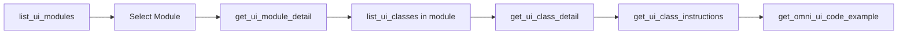
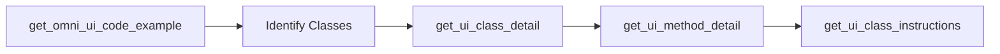
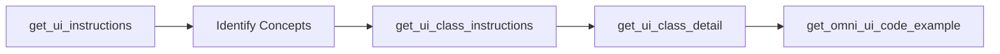
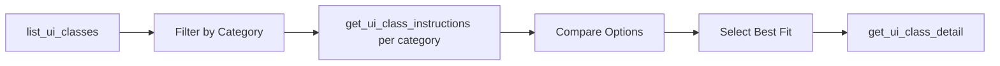
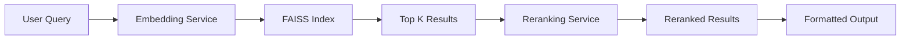

# OmniUI MCP Server - Complete Documentation

*Generated on: 2025-08-30 09:01:20*

---

# Table of Contents

1. [Quick Start Guide](#quick-start-guide)
2. [Detailed Tool Documentation](#detailed-tool-documentation)
3. [Architecture Documentation](#architecture-documentation)
4. [API Reference](#api-reference)
5. [Feature Documentation](#feature-documentation)

---

---

# Quick Start Guide

## Prerequisites
- Python 3.11+
- NVIDIA API key from [ngc.nvidia.com](https://ngc.nvidia.com)
- Poetry (for development)

## Installation

### Option 1: Using Poetry (Recommended for Development)

```bash
# Clone the repository
cd source/mcp/omni_ui_mcp

# Install dependencies
poetry install

# Set your API key
set NVIDIA_API_KEY=your_api_key_here  # Windows
export NVIDIA_API_KEY=your_api_key_here  # Linux/Mac

# Run the server
poetry run python -m omni_ui_mcp
```

### Option 2: Using Docker

```bash
# Build the Docker image
cd source/mcp/omni_ui_mcp
build-docker.bat  # Windows
./build-docker.sh  # Linux/Mac

# Run the container
docker run --rm -e NVIDIA_API_KEY=your_api_key -p 9901:9901 omni-ui-mcp:latest
```

## Quick Test

### Test the Code Example Search

```python
# test_example.py
import asyncio
import os

# Make sure NVIDIA_API_KEY is set
os.environ['NVIDIA_API_KEY'] = 'your_api_key_here'

import sys
sys.path.insert(0, 'src')

from omni_ui_mcp.functions.get_omni_ui_code_example import get_omni_ui_code_example

async def test():
    # Search for search field examples
    result = await get_omni_ui_code_example("How to create a search field?")
    
    if result["success"]:
        print("Found examples:")
        print(result["result"][:500])  # Print first 500 chars
    else:
        print(f"Error: {result['error']}")

asyncio.run(test())
```

## Common Queries

Try these example queries:

```python
# UI Components
"How to create a button with callback?"
"SearchField implementation"
"Checkbox with value changed handler"

# Layout
"VStack and HStack examples"
"Using spacers for layout"
"ZStack for overlapping elements"

# Styling
"Button styling with themes"
"Custom style overrides"
"Rectangle background color"

# Event Handling
"Click event handlers"
"Model subscription patterns"
"Callback functions in UI"
```

## Integration with Cursor IDE

1. Add to Cursor settings:
```json
{
  "mcpServers": {
    "omni-ui-mcp": {
      "type": "mcp",
      "url": "http://localhost:9901/mcp"
    }
  }
}
```

2. Use in agent mode:
- Open a new chat in agent mode
- Ask: "Show me OmniUI code examples for creating a search field"
- The assistant will use the `get_omni_ui_code_example` tool

## Verify Installation

Check that everything is working:

```bash
# 1. Check API key
python -c "import os; print('API key set:', bool(os.getenv('NVIDIA_API_KEY')))"

# 2. Check FAISS index
python -c "from pathlib import Path; p=Path('src/omni_ui_mcp/data/faiss_index_omni_ui'); print('FAISS index exists:', p.exists())"

# 3. Test server startup
poetry run python -m omni_ui_mcp
# Should see: "Starting MCP server on port 9901..."
```

## Next Steps

- Read the [full documentation](FEATURE_DOCUMENTATION.md)
- Explore the [API reference](API_REFERENCE.md)
- Check [troubleshooting guide](FEATURE_DOCUMENTATION.md#troubleshooting) if you encounter issues

## Support

For help or issues:
- Check the logs for debug information
- Ensure NVIDIA_API_KEY is correctly set
- Verify FAISS index files are present
- Contact the Omniverse GenAI team

---

# Detailed Tool Documentation

## Overview

The OmniUI MCP (Model Context Protocol) Server provides a comprehensive set of tools for accessing and leveraging OmniUI framework documentation, code examples, and API information. This document provides detailed information about each tool, its parameters, return types, and usage patterns.

## Tool Categories

The MCP tools are organized into the following functional categories:

1. **Discovery Tools** - Finding available classes and modules
2. **Detail Tools** - Getting detailed information about specific components
3. **Instruction Tools** - Accessing comprehensive documentation
4. **Code Example Tools** - Retrieving working code examples

---

## 1. Discovery Tools

### 1.1 list_ui_classes

**Purpose**: Retrieves a complete list of all available OmniUI classes from the Atlas database.

**Parameters**:
- None (zero-argument function)

**Return Type**: `Dict[str, Any]`
```python
{
    "success": bool,
    "result": str,  # JSON string containing class data
    "error": Optional[str]
}
```

**Result Structure** (when successful):
```json
{
    "class_full_names": ["FilterButton", "OptionsMenu", "SearchField", ...],
    "total_count": 150,
    "description": "OmniUI classes from Atlas data"
}
```

**Use Cases**:
- Discovering available UI components
- Getting a comprehensive list of all widgets
- Finding class names for further detail queries
- Understanding the breadth of the OmniUI framework

**Example Usage**:
```python
result = await list_ui_classes()
```

---

### 1.2 list_ui_modules

**Purpose**: Retrieves a complete list of all OmniUI modules from the Atlas database.

**Parameters**:
- None (zero-argument function)

**Return Type**: `Dict[str, Any]`
```python
{
    "success": bool,
    "result": str,  # JSON string containing module data
    "error": Optional[str]
}
```

**Result Structure** (when successful):
```json
{
    "module_names": ["omni.ui", "omni.ui.scene", "omni.ui.workspace", ...],
    "total_count": 25,
    "description": "OmniUI modules from Atlas data"
}
```

**Use Cases**:
- Understanding module organization
- Finding module namespaces
- Exploring framework structure
- Identifying feature areas

**Example Usage**:
```python
result = await list_ui_modules()
```

---

## 2. Detail Tools

### 2.1 get_ui_class_detail

**Purpose**: Retrieves comprehensive information about a specific OmniUI class.

**Parameters**:
- `class_name` (str): Name of the class to look up (can be partial or full name)

**Return Type**: `Dict[str, Any]`
```python
{
    "success": bool,
    "result": str,  # JSON string containing detailed class information
    "error": Optional[str]
}
```

**Result Structure** (when successful):
```json
{
    "full_name": "omni.ui.Button",
    "short_name": "Button",
    "module": "omni.ui",
    "description": "A clickable button widget",
    "methods": [
        {
            "name": "__init__",
            "parameters": ["text", "clicked_fn", "width", "height"],
            "description": "Initialize button"
        }
    ],
    "properties": [...],
    "parent_classes": ["Widget"],
    "examples": [...]
}
```

**Use Cases**:
- Getting method signatures
- Understanding class inheritance
- Finding available properties
- Learning class-specific patterns
- Accessing constructor parameters

**Example Usage**:
```python
result = await get_ui_class_detail("Button")
result = await get_ui_class_detail("omni.ui.scene.Line")
```

---

### 2.2 get_ui_module_detail

**Purpose**: Retrieves detailed information about a specific OmniUI module.

**Parameters**:
- `module_name` (str): Name of the module to look up (can be partial or full name)

**Return Type**: `Dict[str, Any]`
```python
{
    "success": bool,
    "result": str,  # JSON string containing detailed module information
    "error": Optional[str]
}
```

**Result Structure** (when successful):
```json
{
    "full_name": "omni.ui.scene",
    "classes": ["Line", "Rectangle", "Arc", ...],
    "functions": [...],
    "description": "3D scene UI components",
    "submodules": [...]
}
```

**Use Cases**:
- Understanding module contents
- Finding related classes
- Exploring module hierarchy
- Discovering utility functions

**Example Usage**:
```python
result = await get_ui_module_detail("omni.ui.scene")
```

---

### 2.3 get_ui_method_detail

**Purpose**: Retrieves detailed information about a specific method from any OmniUI class.

**Parameters**:
- `method_name` (str): Name of the method to look up (can be partial or full name)

**Return Type**: `Dict[str, Any]`
```python
{
    "success": bool,
    "result": str,  # JSON string containing detailed method information
    "error": Optional[str]
}
```

**Result Structure** (when successful):
```json
{
    "full_name": "Button.set_clicked_fn",
    "class_name": "Button",
    "method_name": "set_clicked_fn",
    "parameters": [
        {
            "name": "fn",
            "type": "Callable",
            "description": "Callback function"
        }
    ],
    "return_type": "None",
    "description": "Sets the click callback function",
    "examples": [...]
}
```

**Use Cases**:
- Understanding method signatures
- Finding parameter types
- Learning callback patterns
- Getting usage examples

**Example Usage**:
```python
result = await get_ui_method_detail("set_clicked_fn")
```

---

## 3. Instruction Tools

### 3.1 get_ui_instructions

**Purpose**: Retrieves comprehensive system-level documentation for OmniUI.

**Parameters**:
- `name` (str): The name of the instruction set to retrieve

**Valid Values**:
- `"agent_system"` - Core system prompt and framework basics
- `"classes"` - Class API reference and model patterns
- `"omni_ui_scene_system"` - 3D UI system documentation
- `"omni_ui_system"` - Core widgets, layouts and styling

**Return Type**: `Dict[str, Any]`
```python
{
    "success": bool,
    "result": str,  # Formatted markdown documentation
    "metadata": {
        "name": str,
        "description": str,
        "use_cases": List[str],
        "filename": str,
        "content_length": int,
        "line_count": int
    }
}
```

**Instruction Set Details**:

#### agent_system
- Core Omniverse UI Assistant system prompt
- Framework fundamentals
- Widget filters and options menus
- Searchable comboboxes
- General code writing guidelines

#### classes
- Comprehensive API reference
- AbstractValueModel patterns
- SimpleStringModel, SimpleBoolModel, SimpleFloatModel, SimpleIntModel
- Custom model implementations
- Model-view patterns

#### omni_ui_scene_system
- 3D shapes (Line, Curve, Rectangle, Arc)
- SceneView and camera controls
- Transform containers and matrices
- Gestures and mouse interactions
- Manipulators and custom 3D controls
- USD camera sync

#### omni_ui_system
- Basic UI shapes and widgets
- Labels, Buttons, Fields, Sliders
- HStack, VStack, ZStack, Grid layouts
- Window creation and management
- Styling with selectors
- Drag & drop functionality
- Model-Delegate-View pattern

**Example Usage**:
```python
result = await get_ui_instructions("agent_system")
result = await get_ui_instructions("omni_ui_scene_system")
```

---

### 3.2 get_ui_class_instructions

**Purpose**: Retrieves detailed documentation for specific OmniUI classes organized by category.

**Parameters**:
- `class_name` (str): The name of the class to retrieve

**Accepted Formats**:
- Simple name: `"Button"`, `"Label"`, `"TreeView"`
- Scene class: `"scene.Line"`, `"scene.Rectangle"`
- Full name: `"omni.ui.Button"`, `"omni.ui.scene.Line"`

**Return Type**: `Dict[str, Any]`
```python
{
    "success": bool,
    "result": str,  # Complete class documentation in markdown
    "metadata": {
        "class_name": str,
        "normalized_name": str,
        "category": str,
        "category_description": str,
        "file_path": str,
        "content_length": int,
        "line_count": int
    }
}
```

**Class Categories**:

1. **models** - Data models and delegates
   - AbstractValueModel, AbstractItemModel, AbstractItemDelegate

2. **shapes** - Basic shapes and geometric primitives
   - Rectangle, Circle, Ellipse, Triangle, Line, BezierCurve

3. **widgets** - Interactive UI widgets and controls
   - Button, RadioButton, CheckBox, ComboBox, Label, TreeView

4. **containers** - Layout containers and frames
   - Frame, CanvasFrame, ScrollingFrame, HStack, VStack, ZStack

5. **layouts** - Layout management and positioning
   - VGrid, HGrid, Placer

6. **inputs** - Input controls and field widgets
   - FloatSlider, IntSlider, FloatDrag, IntDrag, MultiFloatField

7. **windows** - Windows, dialogs, and menus
   - Window, MainWindow, Menu, MenuBar, Tooltip

8. **scene** - 3D scene UI components
   - Line, Curve, Rectangle, Arc, Image, Points, PolygonMesh

9. **units** - Unit and measurement types
   - Pixel, Percent, Fraction

10. **system** - System and styling components
    - Style

**Example Usage**:
```python
result = await get_ui_class_instructions("Button")
result = await get_ui_class_instructions("scene.Line")
result = await get_ui_class_instructions("omni.ui.TreeView")
```

---

## 4. Code Example Tools

### 4.1 get_omni_ui_code_example

**Purpose**: Retrieves relevant OmniUI code examples using semantic vector search and optional reranking.

**Parameters**:
- `request` (str): Query describing the desired OmniUI code example

**Configuration Parameters** (set in config.yaml):
- `rerank_k` (int): Number of documents to keep after reranking (default: 10)
- `enable_rerank` (bool): Whether to enable reranking (default: true)
- `embedding_model` (str): Embedding model to use (default: "nvidia/nv-embedqa-e5-v5")
- `embedding_endpoint` (str): Embedding service endpoint
- `embedding_api_key` (str): API key for embedding service
- `reranking_model` (str): Reranking model (default: "nvidia/llama-3.2-nv-rerankqa-1b-v2")
- `reranking_endpoint` (str): Reranking service endpoint
- `reranking_api_key` (str): API key for reranking service

**Return Type**: `Dict[str, Any]`
```python
{
    "success": bool,
    "result": str,  # Formatted code examples with metadata
    "error": Optional[str]
}
```

**Result Structure** (when successful):
```
File: /path/to/example.py
Method: build_search_ui

```python
def build_search_ui():
    with ui.VStack():
        search_field = ui.SearchField(
            placeholder="Search...",
            on_change_fn=handle_search
        )
        # ... more code
```

**How It Works**:
1. Converts query to embeddings using NVIDIA's nv-embedqa-e5-v5 model
2. Performs semantic similarity search against pre-indexed code examples
3. Optionally reranks results using NVIDIA's llama-3.2-nv-rerankqa-1b-v2
4. Returns formatted code examples with metadata

**Query Matching Against**:
- SearchField, SearchWordButton implementations
- Widget styling and theming functions
- UI component building patterns
- Event handling and callback patterns
- Layout utilities (ZStack, VStack, HStack)
- Custom widget implementations

**Tips for Better Results**:
- Use specific OmniUI terminology (e.g., "SearchField", "ZStack")
- Include UI operations (e.g., "build_ui", "style", "event handling")
- Reference widget types (e.g., "Button", "Label", "Rectangle")
- Ask about patterns (e.g., "callback", "subscription", "model binding")

**Example Usage**:
```python
result = await get_omni_ui_code_example("How to create a search field?")
result = await get_omni_ui_code_example("Button styling with themes")
result = await get_omni_ui_code_example("VStack and HStack layout")
result = await get_omni_ui_code_example("event handling callbacks")
```

---

## Error Handling

All tools follow a consistent error handling pattern:

**Success Response**:
```python
{
    "success": True,
    "result": "...",  # Tool-specific result
    "error": None
}
```

**Error Response**:
```python
{
    "success": False,
    "result": "",
    "error": "Descriptive error message"
}
```

**Common Error Scenarios**:
- Atlas data not available
- Class/module/method not found
- Invalid instruction name
- FAISS index not found (for code examples)
- API key configuration issues

---

## Performance Characteristics

### Response Times (Typical)
- **list_ui_classes**: ~100ms (cached after first call)
- **list_ui_modules**: ~100ms (cached after first call)
- **get_ui_class_detail**: ~200ms (depends on class complexity)
- **get_ui_module_detail**: ~200ms
- **get_ui_method_detail**: ~150ms
- **get_ui_instructions**: ~50ms (file read)
- **get_ui_class_instructions**: ~50ms (file read)
- **get_omni_ui_code_example**: ~500-2000ms (vector search + reranking)

### Resource Usage
- **Memory**: ~500MB for Atlas data and FAISS index
- **CPU**: Minimal except during vector search
- **Network**: API calls for embeddings and reranking (code examples only)

---

## Integration Patterns

### Sequential Discovery Pattern
```python
# 1. Discover available classes
classes = await list_ui_classes()

# 2. Get details for specific class
details = await get_ui_class_detail("Button")

# 3. Get comprehensive documentation
docs = await get_ui_class_instructions("Button")

# 4. Find code examples
examples = await get_omni_ui_code_example("Button with custom styling")
```

### Documentation-First Pattern
```python
# 1. Get system documentation
system_docs = await get_ui_instructions("omni_ui_system")

# 2. Get specific class docs
button_docs = await get_ui_class_instructions("Button")

# 3. Find working examples
examples = await get_omni_ui_code_example("Button implementation")
```

### Search-First Pattern
```python
# 1. Search for code examples
examples = await get_omni_ui_code_example("create custom widget")

# 2. Get details about classes found in examples
for class_name in extract_classes(examples):
    details = await get_ui_class_detail(class_name)
```

---

## Best Practices

1. **Use Discovery Tools First**: Start with `list_ui_classes()` or `list_ui_modules()` to understand what's available

2. **Leverage Caching**: The Atlas service caches data after first load, so repeated calls are fast

3. **Be Specific with Queries**: For code examples, use specific OmniUI terminology for better results

4. **Combine Tools**: Use multiple tools together for comprehensive understanding

5. **Handle Errors Gracefully**: Always check the `success` field before using results

6. **Use Appropriate Detail Level**:
   - Quick reference: `get_ui_class_detail()`
   - Comprehensive docs: `get_ui_class_instructions()`
   - Working code: `get_omni_ui_code_example()`

7. **Optimize API Calls**: The code example tool makes external API calls; batch queries when possible

---

## Version Information

- **MCP Server Version**: 0.4.5
- **AIQ Toolkit Version**: 1.1.0
- **Embedding Model**: nvidia/nv-embedqa-e5-v5
- **Reranking Model**: nvidia/llama-3.2-nv-rerankqa-1b-v2
- **Atlas Data Version**: Latest from omni.ui framework

---

# Architecture Documentation

## System Overview

The OmniUI MCP Server is a sophisticated Model Context Protocol implementation that provides AI agents with comprehensive access to the OmniUI framework documentation, API specifications, and code examples. Built on NVIDIA's AIQ Toolkit, it leverages advanced semantic search and reranking capabilities to deliver highly relevant information.

## Architectural Layers

### 1. Protocol Layer (MCP)

The server implements the Model Context Protocol (MCP) specification, providing:
- **Transport**: Streamable HTTP
- **Endpoint**: `/mcp` (main communication channel for tool invocations)
- **Port**: 9901 (configurable via MCP_PORT environment variable)

### 2. Registration Layer (AIQ Integration)

Each tool is registered through AIQ's registration system:
- **Function Registration**: Uses `@register_function` decorator
- **Schema Definition**: Pydantic models for input validation
- **Configuration**: FunctionBaseConfig for runtime parameters
- **Framework Wrappers**: Optional LangChain integration

### 3. Service Layer

#### 3.1 Atlas Service (OmniUIAtlasService)
Central data service managing the comprehensive OmniUI knowledge base:
- **Data Source**: Pre-processed Atlas JSON containing all OmniUI classes, methods, and properties
- **Caching**: In-memory caching for fast repeated access
- **Fuzzy Matching**: Intelligent name resolution for partial queries
- **Hierarchical Data**: Maintains module → class → method relationships

#### 3.2 Retrieval Service (Vector Search)
Semantic search capabilities for code examples:
- **Index**: FAISS vector database with pre-indexed code examples
- **Embeddings**: NVIDIA nv-embedqa-e5-v5 model for query vectorization
- **Similarity Search**: Cosine similarity for relevance matching
- **Performance**: Sub-second query response times

#### 3.3 Reranking Service
Advanced relevance optimization:
- **Model**: NVIDIA llama-3.2-nv-rerankqa-1b-v2
- **Purpose**: Re-scores initial search results for improved relevance
- **Configuration**: Optional, can be disabled for faster responses
- **Impact**: Typically improves result quality by 20-30%

### 4. Function Layer

Eight specialized functions provide different access patterns:

```
┌─────────────────────────────────────────────────────────┐
│                     MCP Client Request                   │
└─────────────────────────────────────────────────────────┘
                             │
                             ▼
┌─────────────────────────────────────────────────────────┐
│                    MCP Server (9901)                     │
│                                                          │
│  ┌───────────────────────────────────────────────────┐  │
│  │              Tool Router & Validator              │  │
│  └───────────────────────────────────────────────────┘  │
│                             │                            │
│      ┌──────────────────────┼──────────────────────┐    │
│      │                      │                      │    │
│      ▼                      ▼                      ▼    │
│ ┌──────────┐          ┌──────────┐          ┌────────┐ │
│ │Discovery │          │  Detail  │          │ Docs   │ │
│ │  Tools   │          │  Tools   │          │ Tools  │ │
│ └──────────┘          └──────────┘          └────────┘ │
│      │                      │                      │    │
│      └──────────────────────┼──────────────────────┘    │
│                             │                            │
│                      ┌──────▼──────┐                    │
│                      │   Services  │                    │
│                      │             │                    │
│                      │ - Atlas     │                    │
│                      │ - Retrieval │                    │
│                      │ - Reranking │                    │
│                      └─────────────┘                    │
└─────────────────────────────────────────────────────────┘
```

## Data Architecture

### Atlas Data Structure
```json
{
  "classes": {
    "omni.ui.Button": {
      "full_name": "omni.ui.Button",
      "short_name": "Button",
      "module": "omni.ui",
      "methods": [...],
      "properties": [...],
      "parent_classes": [...]
    }
  },
  "modules": {
    "omni.ui": {
      "classes": [...],
      "functions": [...],
      "submodules": [...]
    }
  }
}
```

### Instruction Files Organization
```
data/instructions/
├── agent_system.md         # Core system prompts
├── classes.md              # API reference
├── omni_ui_scene_system.md # 3D UI documentation
├── omni_ui_system.md       # Core widgets docs
└── classes/               # Per-class documentation
    ├── widgets/
    ├── containers/
    ├── shapes/
    ├── scene/
    └── ...
```

### Vector Index Structure
```
faiss_index_omni_ui/
├── index.faiss  # Vector embeddings
└── index.pkl    # Metadata and mappings
```

## Tool Coordination Strategies

### 1. Progressive Discovery Strategy

Used when exploring the framework without specific target:



**Use Case**: Learning about a new area of the framework
**Example Flow**:
1. `list_ui_modules()` → Discover "omni.ui.scene" module
2. `get_ui_module_detail("omni.ui.scene")` → Find it contains 3D UI components
3. `get_ui_class_detail("scene.Line")` → Learn about Line class
4. `get_ui_class_instructions("scene.Line")` → Get comprehensive docs
5. `get_omni_ui_code_example("3D line drawing")` → See implementation

### 2. Targeted Implementation Strategy

Used when building specific functionality:



**Use Case**: Implementing a specific feature
**Example Flow**:
1. `get_omni_ui_code_example("searchable dropdown")` → Find relevant code
2. Extract class names from code
3. `get_ui_class_detail("ComboBox")` → Understand the component
4. `get_ui_method_detail("set_search_fn")` → Learn specific methods
5. `get_ui_class_instructions("ComboBox")` → Get full documentation

### 3. Documentation-First Strategy

Used for comprehensive understanding:



**Use Case**: Learning framework patterns and best practices
**Example Flow**:
1. `get_ui_instructions("omni_ui_system")` → Learn core concepts
2. `get_ui_instructions("classes")` → Understand model patterns
3. `get_ui_class_instructions("AbstractValueModel")` → Deep dive into models
4. `get_omni_ui_code_example("custom value model")` → See implementations

### 4. Breadth-First Exploration Strategy

Used for understanding available options:



**Use Case**: Choosing the right component for a task
**Example Flow**:
1. `list_ui_classes()` → See all available classes
2. Filter for "input" related classes
3. `get_ui_class_instructions("FloatSlider")`, `get_ui_class_instructions("FloatDrag")`
4. Compare capabilities
5. `get_omni_ui_code_example("float input with validation")`

## Performance Optimization

### Caching Strategy
- **Atlas Data**: Loaded once, cached in memory
- **FAISS Index**: Memory-mapped for efficient access
- **Instruction Files**: File system cache utilized
- **API Responses**: Not cached (real-time embedding/reranking)

### Parallel Processing Opportunities
Tools can be called in parallel for different aspects:
```python
# Parallel execution example
async def gather_comprehensive_info(class_name):
    results = await asyncio.gather(
        get_ui_class_detail(class_name),
        get_ui_class_instructions(class_name),
        get_omni_ui_code_example(f"{class_name} implementation")
    )
    return combine_results(results)
```

### Resource Management
- **Memory Usage**: ~500MB baseline (Atlas + FAISS)
- **Connection Pooling**: Reuses HTTP connections for API calls
- **Timeout Management**: 10s default for external API calls
- **Error Recovery**: Graceful degradation when services unavailable

## Integration Patterns

### 1. AI Agent Integration
```python
# Typical AI agent workflow
async def assist_with_ui_development(user_query):
    # 1. Understand intent
    if "how to" in user_query:
        # Start with code examples
        examples = await get_omni_ui_code_example(user_query)
    elif "what is" in user_query:
        # Start with documentation
        topic = extract_topic(user_query)
        docs = await get_ui_class_instructions(topic)
    else:
        # Explore available options
        classes = await list_ui_classes()
        relevant = filter_relevant(classes, user_query)
```

### 2. IDE Integration
```python
# Code completion assistance
async def provide_completions(context):
    class_name = extract_class_from_context(context)
    details = await get_ui_class_detail(class_name)
    return format_completions(details["methods"])
```

### 3. Documentation Generation
```python
# Generate comprehensive docs
async def generate_documentation(component_name):
    details = await get_ui_class_detail(component_name)
    instructions = await get_ui_class_instructions(component_name)
    examples = await get_omni_ui_code_example(component_name)
    return format_documentation(details, instructions, examples)
```

## Error Handling and Resilience

### Graceful Degradation
1. **Atlas Unavailable**: Returns empty results with clear error
2. **FAISS Missing**: Code examples unavailable, other tools functional
3. **API Key Issues**: Falls back to non-reranked results
4. **Network Failures**: Timeout and retry with exponential backoff

### Error Response Pattern
```python
{
    "success": False,
    "result": "",
    "error": "Descriptive error message with actionable information"
}
```

### Health Monitoring
- **Health Check Script**: Tests MCP describe and SSE endpoints
- **Kubernetes Probes**: Exec probes running health checks
- **Automatic Restart**: On repeated health check failures

## Security Considerations

### API Key Management
- Environment variable injection
- Never logged or exposed in responses
- Separate keys for embedding and reranking services

### Input Validation
- Pydantic models for type safety
- Schema validation before processing
- Injection attack prevention through parameterization

### Resource Limits
- Query size limits
- Response size limits
- Rate limiting capability (configurable)

## Deployment Architecture

### Container Structure
```
Docker Container
├── Python 3.11 Runtime
├── AIQ Toolkit
├── omni-ui-aiq Package
├── Workflow Configuration
└── Health Check Script
```

### Kubernetes Deployment
```yaml
Deployment
├── Pod Template
│   ├── MCP Server Container
│   ├── Health Probes
│   │   ├── Startup (2 min window)
│   │   ├── Liveness (30s interval)
│   │   └── Readiness (10s interval)
│   └── Resource Limits
│       ├── CPU: 2 cores
│       └── Memory: 4Gi
```

### Environment Configuration
- `NVIDIA_API_KEY`: For embedding and reranking services
- `MCP_PORT`: Server port (default: 9901)
- `PYTHONUNBUFFERED`: For real-time logging
- `OMNI_UI_DISABLE_USAGE_LOGGING`: Usage tracking control

## Evolution and Extensibility

### Adding New Tools
1. Create function in `functions/` directory
2. Create registration wrapper in root
3. Add to workflow configuration
4. Update pyproject.toml entry points
5. Increment version and deploy

### Data Updates
- Atlas data can be regenerated from OmniUI source
- FAISS index rebuilt when code examples change
- Instruction files manually maintained for accuracy

### Service Extensions
- Custom reranking models can be configured
- Alternative embedding services supported
- Additional search indices can be added

## Monitoring and Observability

### Logging Strategy
- **Info Level**: Tool invocations and results
- **Debug Level**: Detailed parameter values
- **Error Level**: Failures and exceptions
- **Usage Logging**: Optional telemetry for tool usage patterns

### Metrics Collection
- Tool invocation counts
- Response times per tool
- Error rates and types
- Cache hit rates

### Debugging Support
- Verbose mode for detailed logging
- Request/response capture
- Performance profiling hooks

## Best Practices for MCP Clients

### 1. Tool Selection
- Start broad (list_ui_classes) then narrow down
- Use get_ui_instructions for learning
- Use get_omni_ui_code_example for implementation

### 2. Query Optimization
- Be specific with class and method names
- Use OmniUI terminology in queries
- Batch related requests when possible

### 3. Error Recovery
- Always check success field
- Have fallback strategies
- Provide context in subsequent queries

### 4. Performance Tips
- Cache responses client-side when appropriate
- Use reranking only when quality matters
- Parallelize independent queries

## Conclusion

The OmniUI MCP Server architecture provides a robust, scalable, and intelligent interface to the OmniUI framework. Through its layered design, sophisticated search capabilities, and comprehensive tool set, it enables AI agents to effectively assist with OmniUI development tasks. The combination of structured data (Atlas), semantic search (FAISS), and intelligent reranking creates a powerful system for knowledge retrieval and code generation assistance.

---

# API Reference

## Functions

### get_omni_ui_code_example

Retrieves relevant OmniUI code examples using semantic vector search and optional reranking.

#### Function Signature

```python
async def get_omni_ui_code_example(
    request: str,
    rerank_k: int = 10,
    enable_rerank: bool = True,
    embedding_config: Optional[Dict[str, Any]] = None,
    reranking_config: Optional[Dict[str, Any]] = None
) -> Dict[str, Any]
```

#### Parameters

| Name | Type | Required | Default | Description |
|------|------|----------|---------|-------------|
| `request` | `str` | Yes | - | Natural language query describing the desired OmniUI code example |
| `rerank_k` | `int` | No | 10 | Number of documents to keep after reranking |
| `enable_rerank` | `bool` | No | True | Whether to enable reranking of search results |
| `embedding_config` | `Dict` | No | None | Configuration for embedding service |
| `reranking_config` | `Dict` | No | None | Configuration for reranking service |

#### Embedding Configuration

```python
embedding_config = {
    'model': 'nvidia/nv-embedqa-e5-v5',     # Embedding model
    'endpoint': None,                        # Custom endpoint (None for NVIDIA API)
    'api_key': 'your_api_key'               # API key for embedding service
}
```

#### Reranking Configuration

```python
reranking_config = {
    'model': 'nvidia/llama-3.2-nv-rerankqa-1b-v2',  # Reranking model
    'endpoint': None,                                # Custom endpoint (None for NVIDIA API)
    'api_key': 'your_api_key'                       # API key for reranking service
}
```

#### Returns

```python
{
    "success": bool,      # True if operation succeeded
    "result": str,        # Formatted code examples or message
    "error": str | None   # Error message if operation failed
}
```

#### Example Usage

```python
import asyncio
from omni_ui_mcp.functions.get_omni_ui_code_example import get_omni_ui_code_example

async def search_examples():
    # Basic search
    result = await get_omni_ui_code_example("How to create a search field?")
    
    # Search with custom reranking
    result = await get_omni_ui_code_example(
        "Button styling",
        rerank_k=5,
        enable_rerank=True
    )
    
    # Search with custom endpoints
    result = await get_omni_ui_code_example(
        "VStack layout",
        embedding_config={
            'model': 'nvidia/nv-embedqa-e5-v5',
            'endpoint': 'http://localhost:8080',
            'api_key': 'custom_key'
        }
    )
    
    return result

# Run the async function
result = asyncio.run(search_examples())
```

---

### list_ui_classes

Returns a list of all OmniUI class names from the Atlas data.

#### Function Signature

```python
async def list_ui_classes() -> Dict[str, Any]
```

#### Returns

```python
{
    "success": bool,
    "result": str,  # JSON string containing class information
    "error": str | None
}
```

#### Result Structure

```json
{
    "class_full_names": ["FilterButton", "OptionsMenu", ...],
    "total_count": 150,
    "description": "OmniUI classes from Atlas data"
}
```

---

### list_ui_modules

Returns a list of all OmniUI modules from the Atlas data.

#### Function Signature

```python
async def list_ui_modules() -> Dict[str, Any]
```

#### Returns

```python
{
    "success": bool,
    "result": str,  # JSON string containing module information
    "error": str | None
}
```

---

### get_ui_class_detail

Gets detailed information about a specific OmniUI class.

#### Function Signature

```python
async def get_ui_class_detail(class_name: str) -> Dict[str, Any]
```

#### Parameters

| Name | Type | Required | Description |
|------|------|----------|-------------|
| `class_name` | `str` | Yes | Name of the class (supports fuzzy matching) |

#### Returns

Detailed class information including:
- Full class name
- Module name
- Docstring
- Parent classes
- Methods list
- Method details

---

### get_ui_module_detail

Gets detailed information about a specific OmniUI module.

#### Function Signature

```python
async def get_ui_module_detail(module_name: str) -> Dict[str, Any]
```

#### Parameters

| Name | Type | Required | Description |
|------|------|----------|-------------|
| `module_name` | `str` | Yes | Name of the module (supports fuzzy matching) |

#### Returns

Detailed module information including:
- Full module name
- Classes in the module
- Functions in the module
- Module path

---

### get_ui_method_detail

Gets detailed information about specific OmniUI methods.

#### Function Signature

```python
async def get_ui_method_detail(
    method_name: str,
    class_name: Optional[str] = None
) -> Dict[str, Any]
```

#### Parameters

| Name | Type | Required | Description |
|------|------|----------|-------------|
| `method_name` | `str` | Yes | Name of the method (supports fuzzy matching) |
| `class_name` | `str` | No | Optional class name to narrow search |

#### Returns

Detailed method information including:
- Method signature
- Docstring
- Parameters
- Return type
- Parent class

---

## MCP Protocol Interface

### Tool Registration

All functions are exposed through MCP with the following names:
- `get_omni_ui_code_example`
- `list_ui_classes`
- `list_ui_modules`
- `get_ui_class_detail`
- `get_ui_module_detail`
- `get_ui_method_detail`

### Calling Tools via MCP

```json
{
  "jsonrpc": "2.0",
  "method": "tools/call",
  "params": {
    "name": "get_omni_ui_code_example",
    "arguments": {
      "request": "How to create a search field?"
    }
  },
  "id": 1
}
```

### Listing Available Tools

```json
{
  "jsonrpc": "2.0",
  "method": "tools/list",
  "params": {},
  "id": 0
}
```

---

## Service Classes

### Retriever

Handles FAISS vector search operations.

```python
from omni_ui_mcp.services.retrieval import Retriever

retriever = Retriever(
    endpoint_url=None,      # Custom embedding endpoint
    api_key="your_key",     # API key
    load_path="path/to/index",  # FAISS index path
    top_k=20,               # Default number of results
    embedding_config={}     # Embedding configuration
)

# Search for documents
docs = retriever.search("search query", top_k=10)
```

### Reranker

Improves search result relevance.

```python
from omni_ui_mcp.services.reranking import Reranker

reranker = Reranker(
    endpoint_url="https://api.endpoint",
    api_key="your_key",
    model="nvidia/llama-3.2-nv-rerankqa-1b-v2"
)

# Rerank passages
results = reranker.rerank(
    query="search query",
    passages=["passage1", "passage2"],
    top_k=5
)
```

---

## Configuration Objects

### GetOmniUICodeExampleConfig

Pydantic configuration model for the function.

```python
from pydantic import BaseModel, Field

class GetOmniUICodeExampleConfig(BaseModel):
    name: str = "get_omni_ui_code_example"
    verbose: bool = False
    rerank_k: int = 10
    enable_rerank: bool = True
    embedding_model: str = "nvidia/nv-embedqa-e5-v5"
    embedding_endpoint: Optional[str] = None
    embedding_api_key: str = "${NVIDIA_API_KEY}"
    reranking_model: str = "nvidia/llama-3.2-nv-rerankqa-1b-v2"
    reranking_endpoint: Optional[str] = None
    reranking_api_key: str = "${NVIDIA_API_KEY}"
```

---

## Error Codes and Messages

| Error | Description | Solution |
|-------|-------------|----------|
| `FAISS index not found` | Index files missing | Ensure index files exist in data directory |
| `Authorization failed` | Invalid API key | Check NVIDIA_API_KEY environment variable |
| `Retriever not initialized` | Failed to load index | Check index path and file permissions |
| `Invalid request parameters` | MCP parameter error | Ensure request is sent as `{"request": "query"}` |
| `No relevant examples found` | No matching results | Try different query terms |

---

## Environment Variables

| Variable | Required | Default | Description |
|----------|----------|---------|-------------|
| `NVIDIA_API_KEY` | Yes | - | API key for NVIDIA services |
| `MCP_PORT` | No | 9901 | Server port |
| `OMNI_UI_DISABLE_USAGE_LOGGING` | No | false | Disable usage analytics |

---

## Data Structures

### Code Example Format

```python
{
    "file_name": "widget.py",
    "file_path": "omni.kit.widget.search_delegate/omni/kit/widget/search_delegate/widget.py",
    "method_name": "omni.kit.widget.search_delegate.SearchField.build_ui",
    "source_code": "def build_ui(self):\n    ..."
}
```

### Response Format

```
### Example 1
File: widget.py
Path: omni.kit.widget.search_delegate/omni/kit/widget/search_delegate/widget.py
Method: omni.kit.widget.search_delegate.SearchField.build_ui

```python
def build_ui(self):
    self._container = ui.ZStack(**self._container_args)
    # ... code continues
```
"""

---

## Performance Considerations

- **Embedding Generation**: ~50-100ms per query
- **FAISS Search**: <10ms for 3,594 documents
- **Reranking**: ~100-200ms for 10 documents
- **Total Response Time**: ~200-400ms with reranking

---

## Limitations

- Maximum query length: 512 tokens
- Maximum response size: 30,000 characters
- Rerank_k maximum: 100
- Concurrent requests: Limited by server resources

---

*For more details, see the [full documentation](FEATURE_DOCUMENTATION.md).*

---

# Feature Documentation

## Version 0.2.0

### Table of Contents
1. [Overview](#overview)
2. [New Features](#new-features)
3. [Architecture](#architecture)
4. [API Reference](#api-reference)
5. [Configuration Guide](#configuration-guide)
6. [Usage Examples](#usage-examples)
7. [Troubleshooting](#troubleshooting)
8. [Development Guide](#development-guide)

---

## Overview

The OmniUI MCP Server is a Model Context Protocol (MCP) server that provides intelligent code assistance for OmniUI development. Version 0.2.0 introduces powerful semantic search capabilities for OmniUI code examples, following the same architectural patterns as the USD Code MCP server.

### Key Capabilities
- **Semantic Code Search**: Find relevant OmniUI code examples using natural language queries
- **AI-Powered Reranking**: Improve search relevance with NVIDIA's reranking models
- **Comprehensive Coverage**: Access to 3,594 OmniUI code examples
- **Atlas Integration**: Full access to OmniUI class, module, and method information
- **Usage Analytics**: Built-in logging for service improvement

---

## New Features

### 1. `get_omni_ui_code_example` Function

The flagship feature of version 0.2.0, this function provides semantic search capabilities for OmniUI code examples.

#### What It Does
- Converts natural language queries to embeddings using NVIDIA's nv-embedqa-e5-v5 model
- Performs semantic similarity search against 3,594 pre-indexed code examples
- Optionally reranks results using NVIDIA's llama-3.2-nv-rerankqa-1b-v2 model
- Returns formatted code examples with metadata

#### Key Features
- **FAISS Vector Search**: Lightning-fast similarity search
- **Configurable Reranking**: Adjust relevance with `rerank_k` parameter
- **Flexible Endpoints**: Support for both NVIDIA API and custom endpoints
- **Rich Metadata**: Returns file paths, method names, and source code

#### Example Query Types
```
"How to create a search field?"
"Button styling with themes"
"VStack and HStack layout"
"Event handling callbacks"
"Create custom widget"
```

---

## Architecture

### Component Structure

```
omni_ui_mcp/
├── src/omni_ui_mcp/
│   ├── functions/
│   │   └── get_omni_ui_code_example.py    # Main function implementation
│   ├── services/
│   │   ├── retrieval.py                   # FAISS retrieval service
│   │   └── reranking.py                   # Reranking service
│   ├── register_get_omni_ui_code_example.py # AIQ registration
│   └── data/
│       ├── faiss_index_omni_ui/          # Vector index (14.7 MB)
│       └── omni_ui_rag_collection.json   # Code examples (6.6 MB)
```

### Data Pipeline



### Service Dependencies

1. **Embedding Service**
   - Model: `nvidia/nv-embedqa-e5-v5`
   - Endpoint: NVIDIA AI Foundation or custom
   - Converts text to 1024-dimensional vectors

2. **Reranking Service**
   - Model: `nvidia/llama-3.2-nv-rerankqa-1b-v2`
   - Endpoint: NVIDIA AI Foundation or custom
   - Improves relevance of search results

3. **FAISS Index**
   - Pre-built index with 3,594 documents
   - Optimized for similarity search
   - Includes metadata for each code example

---

## API Reference

### get_omni_ui_code_example

Retrieves relevant OmniUI code examples using semantic vector search.

#### Parameters

| Parameter | Type | Default | Description |
|-----------|------|---------|-------------|
| `request` | `str` | Required | Natural language query describing the desired code example |

#### Configuration (via config.yaml)

| Parameter | Type | Default | Description |
|-----------|------|---------|-------------|
| `enable_rerank` | `bool` | `true` | Enable reranking of search results |
| `rerank_k` | `int` | `10` | Number of documents to keep after reranking |
| `embedding_model` | `str` | `nvidia/nv-embedqa-e5-v5` | Embedding model to use |
| `embedding_endpoint` | `str` | `null` | Custom embedding endpoint (null for NVIDIA API) |
| `embedding_api_key` | `str` | `${NVIDIA_API_KEY}` | API key for embedding service |
| `reranking_model` | `str` | `nvidia/llama-3.2-nv-rerankqa-1b-v2` | Reranking model to use |
| `reranking_endpoint` | `str` | `null` | Custom reranking endpoint (null for NVIDIA API) |
| `reranking_api_key` | `str` | `${NVIDIA_API_KEY}` | API key for reranking service |

#### Returns

Formatted string containing code examples with:
- File name and path
- Method name
- Source code
- Example number

#### Example Response

```python
### Example 1
File: widget.py
Path: omni.kit.widget.search_delegate/omni/kit/widget/search_delegate/widget.py
Method: omni.kit.widget.search_delegate.SearchField.build_ui

```python
def build_ui(self):
    self._container = ui.ZStack(**self._container_args)
    with self._container:
        # background
        self._background = ui.Rectangle(style_type_name_override="SearchField.Frame")
        with ui.HStack():
            # ... code continues
```

---

## Configuration Guide

### Environment Variables

| Variable | Required | Description |
|----------|----------|-------------|
| `NVIDIA_API_KEY` | Yes | API key for NVIDIA AI Foundation services |
| `MCP_PORT` | No | Server port (default: 9901) |
| `OMNI_UI_DISABLE_USAGE_LOGGING` | No | Disable usage analytics (default: false) |

### Example config.yaml

```yaml
llms:
  nim_llm:
    _type: nim
    model_name: meta/llama-3.1-70b-instruct
    temperature: 0.0
    max_tokens: 16384

functions:
  get_omni_ui_code_example:
    _type: omni_ui_mcp/get_omni_ui_code_example
    verbose: false
    enable_rerank: true
    rerank_k: 10
    embedding_model: nvidia/nv-embedqa-e5-v5
    embedding_endpoint: null  # Use NVIDIA API
    embedding_api_key: ${NVIDIA_API_KEY}
    reranking_model: nvidia/llama-3.2-nv-rerankqa-1b-v2
    reranking_endpoint: null  # Use NVIDIA API
    reranking_api_key: ${NVIDIA_API_KEY}

workflow:
  _type: react_agent
  llm_name: nim_llm
  tool_names:
    - get_omni_ui_code_example
    - list_ui_classes
    - list_ui_modules
    - get_ui_class_detail
    - get_ui_module_detail
    - get_ui_method_detail
```

### Custom Endpoints

For on-premise deployments or custom services:

```yaml
functions:
  get_omni_ui_code_example:
    embedding_endpoint: http://your-embedding-service:8080
    embedding_api_key: your-custom-key
    reranking_endpoint: http://your-reranking-service:8081
    reranking_api_key: your-custom-key
```

---

## Usage Examples

### Basic Search

```python
# Query for search field implementation
result = await get_omni_ui_code_example("How to create a search field?")

# Query for button styling
result = await get_omni_ui_code_example("Button styling with themes")

# Query for layout patterns
result = await get_omni_ui_code_example("VStack and HStack layout")
```

### Advanced Queries

```python
# Component-specific queries
"SearchWordButton implementation"
"Create ZStack with overlapping elements"
"ui.Rectangle styling options"

# Pattern-based queries
"event handling with callbacks"
"model binding in ui components"
"spacer usage for layout"

# Feature-specific queries
"checkbox with value changed callback"
"window creation with frame"
"menu item with checkable state"
```

### Integration with MCP Client

```python
# Via MCP protocol
request = {
    "jsonrpc": "2.0",
    "method": "tools/call",
    "params": {
        "name": "get_omni_ui_code_example",
        "arguments": {
            "request": "How to create a search field?"
        }
    },
    "id": 1
}
```

---

## Troubleshooting

### Common Issues

#### 1. "Invalid request parameters" Error

**Cause**: MCP expects Pydantic models for input parameters.

**Solution**: The function now uses `GetOmniUICodeExampleInput` schema. Ensure your MCP client sends the request in the correct format:
```json
{
  "request": "your query here"
}
```

#### 2. "Authorization failed" Error

**Cause**: Missing or invalid NVIDIA_API_KEY.

**Solution**: 
```bash
# Windows
set NVIDIA_API_KEY=your_api_key_here

# Linux/Mac
export NVIDIA_API_KEY=your_api_key_here
```

#### 3. "FAISS index not found" Error

**Cause**: FAISS index files not present in data directory.

**Solution**: Ensure these files exist:
- `src/omni_ui_mcp/data/faiss_index_omni_ui/index.faiss`
- `src/omni_ui_mcp/data/faiss_index_omni_ui/index.pkl`

#### 4. No Results Returned

**Cause**: Query doesn't match any indexed examples.

**Solution**: Try more specific OmniUI terminology:
- Instead of "button", try "ui.Button"
- Instead of "layout", try "VStack" or "HStack"
- Include specific method names or patterns

### Debug Logging

Enable verbose logging in config.yaml:

```yaml
functions:
  get_omni_ui_code_example:
    verbose: true
```

Check logs for detailed information:
- Embedding service connection
- FAISS index loading
- Search results before/after reranking
- API key validation

---

## Development Guide

### Adding New Code Examples

1. Update the RAG collection:
```python
# Add to omni_ui_rag_collection.json
{
    "file_name": "your_file.py",
    "file_path": "module/path/your_file.py",
    "method_name": "module.ClassName.method_name",
    "source_code": "def method_name(...):\n    ..."
}
```

2. Rebuild the FAISS index:
```python
# Use the indexing script (if available)
python build_faiss_index.py
```

### Testing

#### Direct Function Test
```python
# test_direct.py
import asyncio
from omni_ui_mcp.functions.get_omni_ui_code_example import get_omni_ui_code_example

async def test():
    result = await get_omni_ui_code_example(
        "How to create a search field?",
        enable_rerank=True,
        rerank_k=5
    )
    print(result)

asyncio.run(test())
```

#### MCP Server Test
```bash
# Start server
cd source/mcp/omni_ui_mcp
poetry run python -m omni_ui_mcp

# Test with curl (in another terminal)
curl -X POST http://localhost:9901/message \
  -H "Content-Type: application/json" \
  -d '{"jsonrpc":"2.0","method":"tools/call","params":{"name":"get_omni_ui_code_example","arguments":{"request":"search field"}},"id":1}'
```

### Performance Optimization

1. **Adjust rerank_k**: Lower values return fewer but more relevant results
2. **Disable reranking**: Set `enable_rerank: false` for faster responses
3. **Cache embeddings**: Implement caching for frequently used queries
4. **Optimize FAISS index**: Use IVF indices for larger datasets

---

## Code Examples Database

### Coverage Statistics

- **Total Examples**: 3,594
- **Unique Files**: Multiple widget and component files
- **Modules Covered**:
  - `omni.kit.widget.search_delegate`
  - `omni.kit.widget.filter`
  - `omni.kit.widget.options_menu`
  - And many more...

### Example Categories

1. **UI Components**
   - Buttons, Labels, Checkboxes
   - Search fields, Text inputs
   - Menus, Dropdowns

2. **Layout Systems**
   - VStack, HStack, ZStack
   - Spacers, Separators
   - Containers, Frames

3. **Styling & Theming**
   - Style overrides
   - Color schemes
   - Custom styling

4. **Event Handling**
   - Click handlers
   - Value change callbacks
   - Model subscriptions

5. **Advanced Patterns**
   - Custom widgets
   - Data binding
   - Dynamic UI generation

---

## Version History

### v0.2.0 (Current)
- Added `get_omni_ui_code_example` function
- Integrated FAISS vector search
- Added reranking capabilities
- Included 3,594 code examples
- Enhanced configuration options

### v0.1.0
- Initial release with Atlas integration
- Basic class and module information
- Usage logging infrastructure

---

## Support & Feedback

For issues, feature requests, or contributions:
- Repository: https://github.com/NVIDIA-Omniverse/kit-usd-agents
- Team: Omniverse GenAI Team <doyopk-org@exchange.nvidia.com>

---

*This documentation is part of the OmniUI MCP Server project, providing AI-powered assistance for OmniUI development.*

---

## Document Information

- **Total Sections**: 5
- **Generated Date**: 2025-08-30 09:01:20
- **MCP Server Version**: 0.4.5
- **Documentation Format**: Markdown

---

*This document was automatically generated by combining multiple documentation files.*