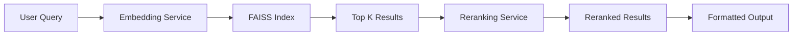

# OmniUI MCP Server - Feature Documentation

## Version 0.2.0

### Table of Contents
1. [Overview](#overview)
2. [New Features](#new-features)
3. [Architecture](#architecture)
4. [API Reference](#api-reference)
5. [Configuration Guide](#configuration-guide)
6. [Usage Examples](#usage-examples)
7. [Troubleshooting](#troubleshooting)
8. [Development Guide](#development-guide)

---

## Overview

The OmniUI MCP Server is a Model Context Protocol (MCP) server that provides intelligent code assistance for OmniUI development. Version 0.2.0 introduces powerful semantic search capabilities for OmniUI code examples, following the same architectural patterns as the USD Code MCP server.

### Key Capabilities
- **Semantic Code Search**: Find relevant OmniUI code examples using natural language queries
- **AI-Powered Reranking**: Improve search relevance with NVIDIA's reranking models
- **Comprehensive Coverage**: Access to 3,594 OmniUI code examples
- **Atlas Integration**: Full access to OmniUI class, module, and method information
- **Usage Analytics**: Built-in logging for service improvement

---

## New Features

### 1. `get_omni_ui_code_example` Function

The flagship feature of version 0.2.0, this function provides semantic search capabilities for OmniUI code examples.

#### What It Does
- Converts natural language queries to embeddings using NVIDIA's nv-embedqa-e5-v5 model
- Performs semantic similarity search against 3,594 pre-indexed code examples
- Optionally reranks results using NVIDIA's llama-3.2-nv-rerankqa-1b-v2 model
- Returns formatted code examples with metadata

#### Key Features
- **FAISS Vector Search**: Lightning-fast similarity search
- **Configurable Reranking**: Adjust relevance with `rerank_k` parameter
- **Flexible Endpoints**: Support for both NVIDIA API and custom endpoints
- **Rich Metadata**: Returns file paths, method names, and source code

#### Example Query Types
```
"How to create a search field?"
"Button styling with themes"
"VStack and HStack layout"
"Event handling callbacks"
"Create custom widget"
```

---

## Architecture

### Component Structure

```
omni_ui_mcp/
├── src/omni_ui_mcp/
│   ├── functions/
│   │   └── get_omni_ui_code_example.py    # Main function implementation
│   ├── services/
│   │   ├── retrieval.py                   # FAISS retrieval service
│   │   └── reranking.py                   # Reranking service
│   ├── register_get_omni_ui_code_example.py # AIQ registration
│   └── data/
│       ├── faiss_index_omni_ui/          # Vector index (14.7 MB)
│       └── omni_ui_rag_collection.json   # Code examples (6.6 MB)
```

### Data Pipeline



### Service Dependencies

1. **Embedding Service**
   - Model: `nvidia/nv-embedqa-e5-v5`
   - Endpoint: NVIDIA AI Foundation or custom
   - Converts text to 1024-dimensional vectors

2. **Reranking Service**
   - Model: `nvidia/llama-3.2-nv-rerankqa-1b-v2`
   - Endpoint: NVIDIA AI Foundation or custom
   - Improves relevance of search results

3. **FAISS Index**
   - Pre-built index with 3,594 documents
   - Optimized for similarity search
   - Includes metadata for each code example

---

## API Reference

### get_omni_ui_code_example

Retrieves relevant OmniUI code examples using semantic vector search.

#### Parameters

| Parameter | Type | Default | Description |
|-----------|------|---------|-------------|
| `request` | `str` | Required | Natural language query describing the desired code example |

#### Configuration (via config.yaml)

| Parameter | Type | Default | Description |
|-----------|------|---------|-------------|
| `enable_rerank` | `bool` | `true` | Enable reranking of search results |
| `rerank_k` | `int` | `10` | Number of documents to keep after reranking |
| `embedding_model` | `str` | `nvidia/nv-embedqa-e5-v5` | Embedding model to use |
| `embedding_endpoint` | `str` | `null` | Custom embedding endpoint (null for NVIDIA API) |
| `embedding_api_key` | `str` | `${NVIDIA_API_KEY}` | API key for embedding service |
| `reranking_model` | `str` | `nvidia/llama-3.2-nv-rerankqa-1b-v2` | Reranking model to use |
| `reranking_endpoint` | `str` | `null` | Custom reranking endpoint (null for NVIDIA API) |
| `reranking_api_key` | `str` | `${NVIDIA_API_KEY}` | API key for reranking service |

#### Returns

Formatted string containing code examples with:
- File name and path
- Method name
- Source code
- Example number

#### Example Response

```python
### Example 1
File: widget.py
Path: omni.kit.widget.search_delegate/omni/kit/widget/search_delegate/widget.py
Method: omni.kit.widget.search_delegate.SearchField.build_ui

```python
def build_ui(self):
    self._container = ui.ZStack(**self._container_args)
    with self._container:
        # background
        self._background = ui.Rectangle(style_type_name_override="SearchField.Frame")
        with ui.HStack():
            # ... code continues
```

---

## Configuration Guide

### Environment Variables

| Variable | Required | Description |
|----------|----------|-------------|
| `NVIDIA_API_KEY` | Yes | API key for NVIDIA AI Foundation services |
| `MCP_PORT` | No | Server port (default: 9901) |
| `OMNI_UI_DISABLE_USAGE_LOGGING` | No | Disable usage analytics (default: false) |

### Example config.yaml

```yaml
llms:
  nim_llm:
    _type: nim
    model_name: meta/llama-3.1-70b-instruct
    temperature: 0.0
    max_tokens: 16384

functions:
  get_omni_ui_code_example:
    _type: omni_ui_mcp/get_omni_ui_code_example
    verbose: false
    enable_rerank: true
    rerank_k: 10
    embedding_model: nvidia/nv-embedqa-e5-v5
    embedding_endpoint: null  # Use NVIDIA API
    embedding_api_key: ${NVIDIA_API_KEY}
    reranking_model: nvidia/llama-3.2-nv-rerankqa-1b-v2
    reranking_endpoint: null  # Use NVIDIA API
    reranking_api_key: ${NVIDIA_API_KEY}

workflow:
  _type: react_agent
  llm_name: nim_llm
  tool_names:
    - get_omni_ui_code_example
    - list_ui_classes
    - list_ui_modules
    - get_ui_class_detail
    - get_ui_module_detail
    - get_ui_method_detail
```

### Custom Endpoints

For on-premise deployments or custom services:

```yaml
functions:
  get_omni_ui_code_example:
    embedding_endpoint: http://your-embedding-service:8080
    embedding_api_key: your-custom-key
    reranking_endpoint: http://your-reranking-service:8081
    reranking_api_key: your-custom-key
```

---

## Usage Examples

### Basic Search

```python
# Query for search field implementation
result = await get_omni_ui_code_example("How to create a search field?")

# Query for button styling
result = await get_omni_ui_code_example("Button styling with themes")

# Query for layout patterns
result = await get_omni_ui_code_example("VStack and HStack layout")
```

### Advanced Queries

```python
# Component-specific queries
"SearchWordButton implementation"
"Create ZStack with overlapping elements"
"ui.Rectangle styling options"

# Pattern-based queries
"event handling with callbacks"
"model binding in ui components"
"spacer usage for layout"

# Feature-specific queries
"checkbox with value changed callback"
"window creation with frame"
"menu item with checkable state"
```

### Integration with MCP Client

```python
# Via MCP protocol
request = {
    "jsonrpc": "2.0",
    "method": "tools/call",
    "params": {
        "name": "get_omni_ui_code_example",
        "arguments": {
            "request": "How to create a search field?"
        }
    },
    "id": 1
}
```

---

## Troubleshooting

### Common Issues

#### 1. "Invalid request parameters" Error

**Cause**: MCP expects Pydantic models for input parameters.

**Solution**: The function now uses `GetOmniUICodeExampleInput` schema. Ensure your MCP client sends the request in the correct format:
```json
{
  "request": "your query here"
}
```

#### 2. "Authorization failed" Error

**Cause**: Missing or invalid NVIDIA_API_KEY.

**Solution**: 
```bash
# Windows
set NVIDIA_API_KEY=your_api_key_here

# Linux/Mac
export NVIDIA_API_KEY=your_api_key_here
```

#### 3. "FAISS index not found" Error

**Cause**: FAISS index files not present in data directory.

**Solution**: Ensure these files exist:
- `src/omni_ui_mcp/data/faiss_index_omni_ui/index.faiss`
- `src/omni_ui_mcp/data/faiss_index_omni_ui/index.pkl`

#### 4. No Results Returned

**Cause**: Query doesn't match any indexed examples.

**Solution**: Try more specific OmniUI terminology:
- Instead of "button", try "ui.Button"
- Instead of "layout", try "VStack" or "HStack"
- Include specific method names or patterns

### Debug Logging

Enable verbose logging in config.yaml:

```yaml
functions:
  get_omni_ui_code_example:
    verbose: true
```

Check logs for detailed information:
- Embedding service connection
- FAISS index loading
- Search results before/after reranking
- API key validation

---

## Development Guide

### Adding New Code Examples

1. Update the RAG collection:
```python
# Add to omni_ui_rag_collection.json
{
    "file_name": "your_file.py",
    "file_path": "module/path/your_file.py",
    "method_name": "module.ClassName.method_name",
    "source_code": "def method_name(...):\n    ..."
}
```

2. Rebuild the FAISS index:
```python
# Use the indexing script (if available)
python build_faiss_index.py
```

### Testing

#### Direct Function Test
```python
# test_direct.py
import asyncio
from omni_ui_mcp.functions.get_omni_ui_code_example import get_omni_ui_code_example

async def test():
    result = await get_omni_ui_code_example(
        "How to create a search field?",
        enable_rerank=True,
        rerank_k=5
    )
    print(result)

asyncio.run(test())
```

#### MCP Server Test
```bash
# Start server
cd source/mcp/omni_ui_mcp
poetry run python -m omni_ui_mcp

# Test with curl (in another terminal)
curl -X POST http://localhost:9901/message \
  -H "Content-Type: application/json" \
  -d '{"jsonrpc":"2.0","method":"tools/call","params":{"name":"get_omni_ui_code_example","arguments":{"request":"search field"}},"id":1}'
```

### Performance Optimization

1. **Adjust rerank_k**: Lower values return fewer but more relevant results
2. **Disable reranking**: Set `enable_rerank: false` for faster responses
3. **Cache embeddings**: Implement caching for frequently used queries
4. **Optimize FAISS index**: Use IVF indices for larger datasets

---

## Code Examples Database

### Coverage Statistics

- **Total Examples**: 3,594
- **Unique Files**: Multiple widget and component files
- **Modules Covered**:
  - `omni.kit.widget.search_delegate`
  - `omni.kit.widget.filter`
  - `omni.kit.widget.options_menu`
  - And many more...

### Example Categories

1. **UI Components**
   - Buttons, Labels, Checkboxes
   - Search fields, Text inputs
   - Menus, Dropdowns

2. **Layout Systems**
   - VStack, HStack, ZStack
   - Spacers, Separators
   - Containers, Frames

3. **Styling & Theming**
   - Style overrides
   - Color schemes
   - Custom styling

4. **Event Handling**
   - Click handlers
   - Value change callbacks
   - Model subscriptions

5. **Advanced Patterns**
   - Custom widgets
   - Data binding
   - Dynamic UI generation

---

## Version History

### v0.2.0 (Current)
- Added `get_omni_ui_code_example` function
- Integrated FAISS vector search
- Added reranking capabilities
- Included 3,594 code examples
- Enhanced configuration options

### v0.1.0
- Initial release with Atlas integration
- Basic class and module information
- Usage logging infrastructure

---

## Support & Feedback

For issues, feature requests, or contributions:
- Repository: https://github.com/NVIDIA-Omniverse/kit-usd-agents
- Team: Omniverse GenAI Team <doyopk-org@exchange.nvidia.com>

---

*This documentation is part of the OmniUI MCP Server project, providing AI-powered assistance for OmniUI development.*