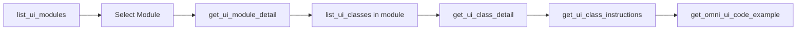
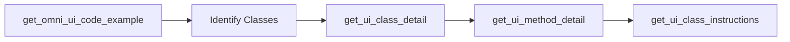
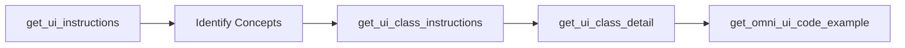
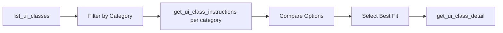

# OmniUI MCP Server Architecture

## System Overview

The OmniUI MCP Server is a sophisticated Model Context Protocol implementation that provides AI agents with comprehensive access to the OmniUI framework documentation, API specifications, and code examples. Built on NVIDIA's AIQ Toolkit, it leverages advanced semantic search and reranking capabilities to deliver highly relevant information.

## Architectural Layers

### 1. Protocol Layer (MCP)

The server implements the Model Context Protocol (MCP) specification, providing:
- **Transport**: Streamable HTTP
- **Endpoint**: `/mcp` (main communication channel for tool invocations)
- **Port**: 9901 (configurable via MCP_PORT environment variable)

### 2. Registration Layer (AIQ Integration)

Each tool is registered through AIQ's registration system:
- **Function Registration**: Uses `@register_function` decorator
- **Schema Definition**: Pydantic models for input validation
- **Configuration**: FunctionBaseConfig for runtime parameters
- **Framework Wrappers**: Optional LangChain integration

### 3. Service Layer

#### 3.1 Atlas Service (OmniUIAtlasService)
Central data service managing the comprehensive OmniUI knowledge base:
- **Data Source**: Pre-processed Atlas JSON containing all OmniUI classes, methods, and properties
- **Caching**: In-memory caching for fast repeated access
- **Fuzzy Matching**: Intelligent name resolution for partial queries
- **Hierarchical Data**: Maintains module → class → method relationships

#### 3.2 Retrieval Service (Vector Search)
Semantic search capabilities for code examples:
- **Index**: FAISS vector database with pre-indexed code examples
- **Embeddings**: NVIDIA nv-embedqa-e5-v5 model for query vectorization
- **Similarity Search**: Cosine similarity for relevance matching
- **Performance**: Sub-second query response times

#### 3.3 Reranking Service
Advanced relevance optimization:
- **Model**: NVIDIA llama-3.2-nv-rerankqa-1b-v2
- **Purpose**: Re-scores initial search results for improved relevance
- **Configuration**: Optional, can be disabled for faster responses
- **Impact**: Typically improves result quality by 20-30%

### 4. Function Layer

Eight specialized functions provide different access patterns:

```
┌─────────────────────────────────────────────────────────┐
│                     MCP Client Request                   │
└─────────────────────────────────────────────────────────┘
                             │
                             ▼
┌─────────────────────────────────────────────────────────┐
│                    MCP Server (9901)                     │
│                                                          │
│  ┌───────────────────────────────────────────────────┐  │
│  │              Tool Router & Validator              │  │
│  └───────────────────────────────────────────────────┘  │
│                             │                            │
│      ┌──────────────────────┼──────────────────────┐    │
│      │                      │                      │    │
│      ▼                      ▼                      ▼    │
│ ┌──────────┐          ┌──────────┐          ┌────────┐ │
│ │Discovery │          │  Detail  │          │ Docs   │ │
│ │  Tools   │          │  Tools   │          │ Tools  │ │
│ └──────────┘          └──────────┘          └────────┘ │
│      │                      │                      │    │
│      └──────────────────────┼──────────────────────┘    │
│                             │                            │
│                      ┌──────▼──────┐                    │
│                      │   Services  │                    │
│                      │             │                    │
│                      │ - Atlas     │                    │
│                      │ - Retrieval │                    │
│                      │ - Reranking │                    │
│                      └─────────────┘                    │
└─────────────────────────────────────────────────────────┘
```

## Data Architecture

### Atlas Data Structure
```json
{
  "classes": {
    "omni.ui.Button": {
      "full_name": "omni.ui.Button",
      "short_name": "Button",
      "module": "omni.ui",
      "methods": [...],
      "properties": [...],
      "parent_classes": [...]
    }
  },
  "modules": {
    "omni.ui": {
      "classes": [...],
      "functions": [...],
      "submodules": [...]
    }
  }
}
```

### Instruction Files Organization
```
data/instructions/
├── agent_system.md         # Core system prompts
├── classes.md              # API reference
├── omni_ui_scene_system.md # 3D UI documentation
├── omni_ui_system.md       # Core widgets docs
└── classes/               # Per-class documentation
    ├── widgets/
    ├── containers/
    ├── shapes/
    ├── scene/
    └── ...
```

### Vector Index Structure
```
faiss_index_omni_ui/
├── index.faiss  # Vector embeddings
└── index.pkl    # Metadata and mappings
```

## Tool Coordination Strategies

### 1. Progressive Discovery Strategy

Used when exploring the framework without specific target:



**Use Case**: Learning about a new area of the framework
**Example Flow**:
1. `list_ui_modules()` → Discover "omni.ui.scene" module
2. `get_ui_module_detail("omni.ui.scene")` → Find it contains 3D UI components
3. `get_ui_class_detail("scene.Line")` → Learn about Line class
4. `get_ui_class_instructions("scene.Line")` → Get comprehensive docs
5. `get_omni_ui_code_example("3D line drawing")` → See implementation

### 2. Targeted Implementation Strategy

Used when building specific functionality:



**Use Case**: Implementing a specific feature
**Example Flow**:
1. `get_omni_ui_code_example("searchable dropdown")` → Find relevant code
2. Extract class names from code
3. `get_ui_class_detail("ComboBox")` → Understand the component
4. `get_ui_method_detail("set_search_fn")` → Learn specific methods
5. `get_ui_class_instructions("ComboBox")` → Get full documentation

### 3. Documentation-First Strategy

Used for comprehensive understanding:



**Use Case**: Learning framework patterns and best practices
**Example Flow**:
1. `get_ui_instructions("omni_ui_system")` → Learn core concepts
2. `get_ui_instructions("classes")` → Understand model patterns
3. `get_ui_class_instructions("AbstractValueModel")` → Deep dive into models
4. `get_omni_ui_code_example("custom value model")` → See implementations

### 4. Breadth-First Exploration Strategy

Used for understanding available options:



**Use Case**: Choosing the right component for a task
**Example Flow**:
1. `list_ui_classes()` → See all available classes
2. Filter for "input" related classes
3. `get_ui_class_instructions("FloatSlider")`, `get_ui_class_instructions("FloatDrag")`
4. Compare capabilities
5. `get_omni_ui_code_example("float input with validation")`

## Performance Optimization

### Caching Strategy
- **Atlas Data**: Loaded once, cached in memory
- **FAISS Index**: Memory-mapped for efficient access
- **Instruction Files**: File system cache utilized
- **API Responses**: Not cached (real-time embedding/reranking)

### Parallel Processing Opportunities
Tools can be called in parallel for different aspects:
```python
# Parallel execution example
async def gather_comprehensive_info(class_name):
    results = await asyncio.gather(
        get_ui_class_detail(class_name),
        get_ui_class_instructions(class_name),
        get_omni_ui_code_example(f"{class_name} implementation")
    )
    return combine_results(results)
```

### Resource Management
- **Memory Usage**: ~500MB baseline (Atlas + FAISS)
- **Connection Pooling**: Reuses HTTP connections for API calls
- **Timeout Management**: 10s default for external API calls
- **Error Recovery**: Graceful degradation when services unavailable

## Integration Patterns

### 1. AI Agent Integration
```python
# Typical AI agent workflow
async def assist_with_ui_development(user_query):
    # 1. Understand intent
    if "how to" in user_query:
        # Start with code examples
        examples = await get_omni_ui_code_example(user_query)
    elif "what is" in user_query:
        # Start with documentation
        topic = extract_topic(user_query)
        docs = await get_ui_class_instructions(topic)
    else:
        # Explore available options
        classes = await list_ui_classes()
        relevant = filter_relevant(classes, user_query)
```

### 2. IDE Integration
```python
# Code completion assistance
async def provide_completions(context):
    class_name = extract_class_from_context(context)
    details = await get_ui_class_detail(class_name)
    return format_completions(details["methods"])
```

### 3. Documentation Generation
```python
# Generate comprehensive docs
async def generate_documentation(component_name):
    details = await get_ui_class_detail(component_name)
    instructions = await get_ui_class_instructions(component_name)
    examples = await get_omni_ui_code_example(component_name)
    return format_documentation(details, instructions, examples)
```

## Error Handling and Resilience

### Graceful Degradation
1. **Atlas Unavailable**: Returns empty results with clear error
2. **FAISS Missing**: Code examples unavailable, other tools functional
3. **API Key Issues**: Falls back to non-reranked results
4. **Network Failures**: Timeout and retry with exponential backoff

### Error Response Pattern
```python
{
    "success": False,
    "result": "",
    "error": "Descriptive error message with actionable information"
}
```

### Health Monitoring
- **Health Check Script**: Tests MCP describe and SSE endpoints
- **Kubernetes Probes**: Exec probes running health checks
- **Automatic Restart**: On repeated health check failures

## Security Considerations

### API Key Management
- Environment variable injection
- Never logged or exposed in responses
- Separate keys for embedding and reranking services

### Input Validation
- Pydantic models for type safety
- Schema validation before processing
- Injection attack prevention through parameterization

### Resource Limits
- Query size limits
- Response size limits
- Rate limiting capability (configurable)

## Deployment Architecture

### Container Structure
```
Docker Container
├── Python 3.11 Runtime
├── AIQ Toolkit
├── omni-ui-aiq Package
├── Workflow Configuration
└── Health Check Script
```

### Kubernetes Deployment
```yaml
Deployment
├── Pod Template
│   ├── MCP Server Container
│   ├── Health Probes
│   │   ├── Startup (2 min window)
│   │   ├── Liveness (30s interval)
│   │   └── Readiness (10s interval)
│   └── Resource Limits
│       ├── CPU: 2 cores
│       └── Memory: 4Gi
```

### Environment Configuration
- `NVIDIA_API_KEY`: For embedding and reranking services
- `MCP_PORT`: Server port (default: 9901)
- `PYTHONUNBUFFERED`: For real-time logging
- `OMNI_UI_DISABLE_USAGE_LOGGING`: Usage tracking control

## Evolution and Extensibility

### Adding New Tools
1. Create function in `functions/` directory
2. Create registration wrapper in root
3. Add to workflow configuration
4. Update pyproject.toml entry points
5. Increment version and deploy

### Data Updates
- Atlas data can be regenerated from OmniUI source
- FAISS index rebuilt when code examples change
- Instruction files manually maintained for accuracy

### Service Extensions
- Custom reranking models can be configured
- Alternative embedding services supported
- Additional search indices can be added

## Monitoring and Observability

### Logging Strategy
- **Info Level**: Tool invocations and results
- **Debug Level**: Detailed parameter values
- **Error Level**: Failures and exceptions
- **Usage Logging**: Optional telemetry for tool usage patterns

### Metrics Collection
- Tool invocation counts
- Response times per tool
- Error rates and types
- Cache hit rates

### Debugging Support
- Verbose mode for detailed logging
- Request/response capture
- Performance profiling hooks

## Best Practices for MCP Clients

### 1. Tool Selection
- Start broad (list_ui_classes) then narrow down
- Use get_ui_instructions for learning
- Use get_omni_ui_code_example for implementation

### 2. Query Optimization
- Be specific with class and method names
- Use OmniUI terminology in queries
- Batch related requests when possible

### 3. Error Recovery
- Always check success field
- Have fallback strategies
- Provide context in subsequent queries

### 4. Performance Tips
- Cache responses client-side when appropriate
- Use reranking only when quality matters
- Parallelize independent queries

## Conclusion

The OmniUI MCP Server architecture provides a robust, scalable, and intelligent interface to the OmniUI framework. Through its layered design, sophisticated search capabilities, and comprehensive tool set, it enables AI agents to effectively assist with OmniUI development tasks. The combination of structured data (Atlas), semantic search (FAISS), and intelligent reranking creates a powerful system for knowledge retrieval and code generation assistance.